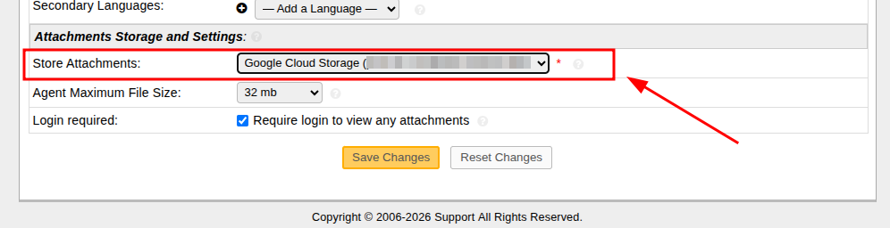

# osTicket: Google Cloud Storage (attachments)

This plugin registers a **file storage backend** for osTicket so new ticket attachments (and other files stored through the same mechanism) are saved as objects in a **Google Cloud Storage** bucket instead of the database.

**Plugin ID:** `osticket:storage-gcp`  
**Backend code:** `G` (shown in the system “Store Attachments” dropdown as `Google Cloud Storage (bucket/prefix)`).

## Requirements

- osTicket **1.17+** (see `ost_version` in `plugin.php`).
- PHP **8.0+** with extensions required by `google/cloud-storage` (e.g. JSON, OpenSSL).
- A GCS **bucket** and a **Google Cloud service account** key (JSON) with appropriate permissions (see below).
- Composer dependencies installed in this directory (`vendor/autoload.php` must exist or the plugin will not register the storage backend on bootstrap).

## Installation

1. Copy the plugin folder to `include/plugins/osticket-storage-gcp/` (or install from your deployment process).
2. From the plugin directory, install PHP dependencies:

   ```bash
   composer install --no-dev
   ```

   In Docker-based setups (example):

   ```bash
   docker compose exec php-fpm sh -c 'cd /var/www/html/include/plugins/osticket-storage-gcp && composer install --no-dev'
   ```

3. In **Admin Panel → Manage → Plugins**, add/install the plugin if it is not already listed, then **enable** it and open its **configuration**.

## Plugin configuration

Open the plugin instance settings and fill in:

| Setting | Description |
|--------|-------------|
| **GCS bucket name** | Name of the target bucket (e.g. `my-project-osticket-attachments`). |
| **Object key prefix** | Optional prefix for object names (no leading slash), e.g. `osticket/prod`. Helps separate environments in one bucket. |
| **Service account credentials** | Either paste the **full service account JSON key** contents, or enter an **absolute filesystem path** to a JSON key file that PHP can read (recommended in production: mount a secret and use the path). The JSON must include `private_key` and `client_email`. |
| **Default signed URL lifetime (seconds)** | Optional. If empty, signed download URLs follow the same “expire at midnight UTC” style behaviour as the official S3 storage plugin when osTicket does not pass a shorter TTL. If set, that many seconds are used as the default lifetime in those cases. |

Saving the form runs a **connectivity check** (`bucket->info()`). If it fails, fix the bucket name, IAM, or credentials before continuing.

### Google Cloud IAM (summary)

Grant the service account at least:

- Object read/write/delete on the bucket (e.g. **Storage Object Admin** on the bucket, or a custom role with `storage.objects.*` as needed).

For **V4 signed URLs** (redirect downloads), the account typically also needs permission to **sign blobs** (e.g. **Service Account Token Creator** on itself, or use a signing method supported by your environment as described in [Google Cloud signed URLs](https://cloud.google.com/storage/docs/access-control/signed-urls)).

## Selecting the default storage backend

Enabling the plugin alone does **not** move attachments to GCS. You must set the system default storage to this backend.

1. Go to **Admin Panel → Settings → System** (or your equivalent **System** settings page).
2. Under **Attachments Storage and Settings**, set **Store Attachments** to the entry labelled **`Google Cloud Storage (...)`** (bucket/prefix as configured).



3. Save settings.

After this, **new** uploads use backend **`G`**. Existing attachments stay on their previous backend until you migrate them (if you use osTicket’s file migration tools).

### Verify that objects land in GCS

- Upload a new attachment and confirm in the database (`ost_file` or your prefixed table) that the row’s **`bk`** column is **`G`**.
- List objects in the bucket (Console or `gsutil ls gs://YOUR-BUCKET/your-prefix/`).

If **`bk`** stays **`D`** (database) despite the plugin being enabled, the **`G`** backend is usually not registered (missing `vendor/autoload.php`) or the default storage dropdown was not switched to Google Cloud Storage.

## Troubleshooting

- **`vendor/autoload.php` missing:** run `composer install` in the plugin directory.
- **Silent fallback to database:** osTicket may catch upload errors and try the next backend. Check PHP / osTicket logs and confirm IAM, bucket name, and credentials.
- **Path to JSON in Docker:** use a path inside the mounted application tree (e.g. under `/var/www/html/...`) so the PHP process can read the file.

## License

See the `LICENSE` file in this repository.
